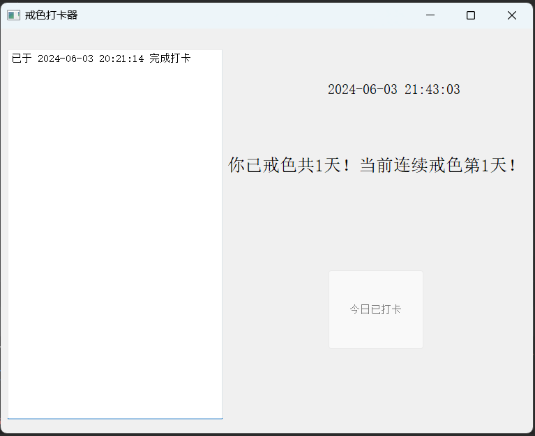

# 这是什么？

---

一个整活用的小软件，给群友们开发的本质打卡类玩意儿，戒冲小助手

# 当前版本

---

1.0初始版

* 使用文件进行数据存储

* 统计戒冲打卡总天数和连续天数

* 每日只可打卡一次，通过系统时间进行判断

* pyqt制作的简陋ui 
  
  

# 更新计划

---

- 预计加入日历功能，可直观通过日历查看打卡情况，已打卡日期则✔，没打卡要不要显示什么还在讨论中

- 如果可以的话把文件存储改为真正的数据库存储，计划使用sqlite

- 美化ui，说实在的pyqt的designer搞ui都搞不熟练搞的头大，能美化一下的话还是美化好
  
  
  
  

# 版本历史

---

无

# 程序示例

---

不能更简单的东西了

# 使用说明

---

每天限打卡一次，统计打卡总次数和最新的连续次数

